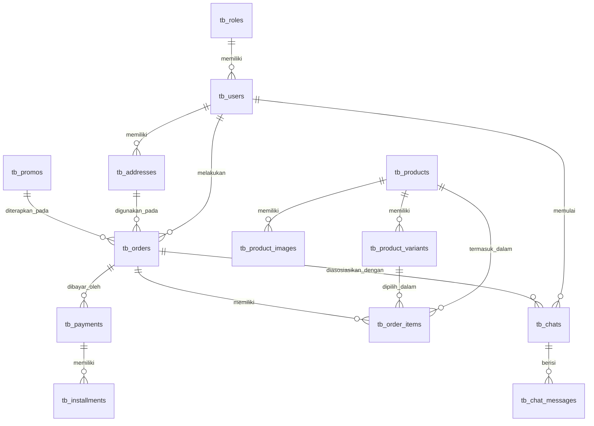

# RANCANG BANGUN POINT OF SALES (POS) DAN MANAJEMEN PEMESANAN PADA PERCETAKAN BERBASIS WEB

[](https://laravel.com)
[](https://www.php.net)
[](https://www.mysql.com)
[](https://getbootstrap.com)
[](LICENSE)
[](#)

Dokumentasi repositori resmi untuk penelitian skripsi oleh **Muhammad Nabil**. Repositori ini memuat seluruh dokumen akademik, berkas presentasi, rancangan antarmuka (wireframe), data responden kuesioner, hingga *source code* lengkap dari sistem informasi berbasis web yang dikembangkan.

---

## 📌 Daftar Isi
1. [Deskripsi Penelitian](#-deskripsi-penelitian)
2. [Teknologi yang Digunakan](#-teknologi-yang-digunakan)
3. [Metodologi Penelitian](#-metodologi-penelitian)
4. [Pengujian Sistem](#-pengujian-sistem)
5. [Struktur Repository](#-struktur-repository)
6. [Dokumentasi Aplikasi](#-dokumentasi-aplikasi)
7. [Penjelasan Isi Folder](#-penjelasan-isi-folder)
8. [Cara Menjalankan Project](#-cara-menjalankan-project)
9. [Struktur Database](#-struktur-database)
10. [Fitur Utama](#-fitur-utama)
11. [Hasil Penelitian](#-hasil-penelitian)
12. [Kesimpulan](#-kesimpulan)
13. [Identitas Penulis](#-identitas-penulis)
14. [Lisensi](#-lisensi)

---

## 📖 Deskripsi Penelitian

### Latar Belakang
**Zimam Advertising (ZimamADV)** merupakan badan usaha yang bergerak di bidang penyediaan jasa percetakan, periklanan, dan layanan desain grafis. Saat ini, seluruh proses operasional di ZimamADV mulai dari penerimaan pesanan, konsultasi konsep desain, pelacakan proses produksi, hingga pembayaran masih dilakukan secara manual dan konvensional. Hal ini memicu berbagai kendala, seperti kesulitan komunikasi jarak jauh terkait persetujuan desain, tidak adanya transparansi progres pengerjaan bagi pelanggan, risiko kesalahan pencatatan transaksi manual, dan ketidakakuratan perhitungan harga untuk produk cetak yang memiliki variasi kustom (seperti ukuran, bahan, dan biaya jasa desain tambahan).

### Permasalahan
1. **Komunikasi & Konsultasi Desain Kurang Terintegrasi**: Pelanggan kesulitan mengirim berkas desain berukuran besar dan melakukan diskusi revisi secara sistematis tanpa tatap muka langsung.
2. **Tidak Adanya Transparansi Status Produksi**: Pelanggan tidak dapat memantau secara langsung apakah pesanan mereka sedang dalam tahap antrean desain, proses cetak, atau telah selesai dikerjakan.
3. **Ketidakakuratan Penentuan Biaya Kustom**: Kesulitan dalam mengalkulasi biaya kustomisasi produk percetakan berdasarkan ukuran dinamis, jenis bahan cetak, serta biaya penanganan jasa desain.
4. **Verifikasi Pembayaran Manual yang Rentan**: Transaksi manual berisiko tinggi terhadap kesalahan pencatatan keuangan serta rawan terhadap manipulasi bukti pembayaran.

### Tujuan Penelitian
Membangun sistem informasi pemesanan jasa percetakan dan layanan desain berbasis web pada Zimam Advertising menggunakan framework Laravel. Sistem ini ditujukan untuk mendigitalisasi seluruh rantai transaksi, mulai dari pemilihan produk, konsultasi desain secara terpadu melalui fitur *live chat*, tracking tahapan produksi, hingga otomatisasi verifikasi pembayaran menggunakan payment gateway.

### Manfaat Penelitian
- **Bagi Pelanggan**: Memberikan kemudahan dalam memesan produk percetakan kapan saja, berkonsultasi desain secara langsung secara online, memantau posisi progres pengerjaan pesanan secara transparan, serta melakukan pembayaran secara instan dan aman.
- **Bagi Admin Toko**: Mempermudah pengelolaan antrean pesanan masuk, memfasilitasi proses penyerahan draf desain kepada pelanggan, memperbarui progres pengerjaan sistematis, serta mengurangi kesalahan validasi bukti transaksi.
- **Bagi Pimpinan**: Menyediakan laporan ringkasan penjualan, omset, dan laporan laba-rugi secara real-time untuk mendukung proses pengambilan keputusan strategis pengembangan bisnis.

---

## 🛠 Teknologi yang Digunakan

Berikut adalah rincian stack teknologi yang diimplementasikan dalam pengembangan sistem informasi ZimamADV:

| Teknologi | Kegunaan |
| :--- | :--- |
| **Laravel** | Framework Backend utama berbasis PHP dengan arsitektur MVC untuk mengelola logika aplikasi dan database. |
| **PHP** | Bahasa pemrograman sisi server (*server-side scripting*) utama untuk membangun sistem. |
| **MySQL** | Sistem Manajemen Basis Data Relasional (RDBMS) untuk menyimpan data transaksi, pengguna, chat, dan katalog produk. |
| **Bootstrap** | Framework CSS untuk mempercepat desain antarmuka pengguna yang responsif (*mobile-friendly*). |
| **HTML** | Struktur markup dasar untuk menyusun elemen-elemen halaman web. |
| **CSS** | Kustomisasi tampilan visual, tata letak, dan konsistensi estetika antarmuka sistem. |
| **JavaScript** | Logika pemrosesan di sisi klien (*client-side*), interaktivitas dinamis halaman, dan manajemen *live chat*. |
| **Midtrans API** | Integrasi Payment Gateway untuk pemrosesan pembayaran otomatis (QRIS, E-Wallet, Virtual Account). |
| **CAPTCHA** | Fitur keamanan tambahan pada formulir autentikasi untuk memvalidasi akses manusia dan menangkal serangan bot. |

---

## 📐 Metodologi Penelitian

Penelitian ini menggunakan metodologi **Agile Development** dengan model **Scrum**. 

Alasan penggunaan metode Scrum adalah:
1. **Fleksibilitas terhadap Perubahan**: Kebutuhan fitur operasional percetakan yang kompleks (seperti kalkulator kustom, live chat, dan pembayaran cicilan) membutuhkan evaluasi berkala yang dinamis. Scrum memungkinkan penulis melakukan adaptasi cepat pada setiap akhir tahapan iterasi (*Sprint*).
2. **Pengembangan Bertahap & Terukur**: Proyek dibagi menjadi beberapa bagian kecil yang dapat diselesaikan dalam jangka waktu 1–4 minggu (*Sprint*), memastikan setiap fitur utama diuji secara bertahap sebelum disatukan ke dalam sistem utuh.
3. **Kolaborasi Intensif**: Evaluasi teratur melalui kegiatan evaluasi sprint mempermudah koordinasi serta memastikan sistem yang dibangun berjalan selaras dengan kebutuhan aktual pemilik usaha (ZimamADV) dan para pelanggan.

---

## 📊 Pengujian Sistem

Pengujian fungsionalitas dan kelayakan sistem dilakukan secara menyeluruh melalui tiga metode utama:

1. **Black Box Testing**: Pengujian untuk memvalidasi fungsionalitas eksternal sistem tanpa melihat struktur kode internal. Pengujian berfokus pada fungsionalitas input dan output pada modul login, pendaftaran pengguna, transaksi pemesanan, sistem keranjang, *live chat*, verifikasi pembayaran Midtrans, dan modul pelaporan pimpinan.
2. **Pengujian Keamanan Akun (CAPTCHA)**: Menguji ketahanan sistem autentikasi dari serangan otomatis (*brute-force* atau bot) dengan mengintegrasikan verifikasi CAPTCHA visual pada formulir Login dan Register.
3. **User Acceptance Testing (UAT)**: Pengujian kelayakan sistem yang melibatkan pengguna akhir secara langsung untuk mengukur tingkat kepuasan serta kesesuaian sistem dengan alur bisnis ZimamADV.

### Tabel Hasil Pengujian

| Aspek Pengujian | Metode Pengujian | Hasil Pengujian | Keterangan |
| :--- | :--- | :--- | :--- |
| **Fungsionalitas Sistem** | Black Box Testing | **100% Sukses** | Seluruh skenario pengujian pada modul Admin, Pelanggan, dan Pimpinan berjalan dengan sukses dan sesuai harapan tanpa *error*. |
| **Keamanan Autentikasi** | Captcha Validation | **100% Sukses** | Sistem berhasil memblokir upaya pengisian formulir otomatis oleh bot dan menolak akses jika kode verifikasi tidak valid. |
| **Kelayakan & Kepuasan Pengguna** | UAT (Kuesioner Pengguna) | **81,29%** | Diperoleh dari umpan balik responden pengguna akhir, masuk ke dalam kategori **Sangat Baik**. |

---

## 📂 Struktur Repository

Berikut adalah susunan struktur folder di dalam repositori **Skripsi Muhammad Nabil**:

```text
Skripsi Muhammad Nabil/
│
├── File Skripsi/
│   ├── Skripsi Final.docx
│   └── Skripsi Final.pdf
│
├── File PPT/
│   ├── PPT Seminar Proposal.pptx
│   └── PPT Sidang Komprehensif.pptx
│
├── Hasil Wireframe/
│   └── File PNG/
│       └── [25 Berkas PNG Hasil Ekspor Wireframe]
│
├── Wireframe/
│   └── File PNG/
│       └── [22 Berkas PNG Desain Rancangan UI]
│
├── Responden/
│   └── Data Kuesioner/
│       └── Data Kuesioner.xlsx
│
├── Produk/
│   ├── Logo/
│   └── Screenshot/
│
├── ZimamAdv/
│   └── [Source Code Project Laravel]
│
└── README.md
```

### Tabel Penjelasan Fungsi Folder

| Folder | Deskripsi |
| :--- | :--- |
| **File Skripsi** | Menyimpan dokumen skripsi final milik Muhammad Nabil dalam format Word (`.docx`) dan Adobe Reader (`.pdf`). |
| **File PPT** | Menyimpan file presentasi pendukung akademik saat Seminar Proposal (Sempro) dan Sidang Komprehensif. |
| **Wireframe** | Menyimpan berkas rancangan awal tata letak antarmuka pengguna (*wireframe*) dalam format PNG sebelum diimplementasikan ke sistem. |
| **Hasil Wireframe** | Menyimpan hasil ekspor representasi visual final dari rancangan tata letak antarmuka aplikasi. |
| **Responden** | Menyimpan data hasil pengumpulan kuesioner pengguna (`.xlsx`) sebagai dasar pengujian UAT. |
| **Produk** | Menyimpan aset visual branding (logo) serta berkas tangkapan layar (*screenshot*) implementasi sistem. |
| **ZimamAdv** | Menyimpan kode program (*source code*) utama proyek aplikasi Point of Sales & Custom Printing berbasis Laravel. |

---

## 🖥 Dokumentasi Aplikasi

Berikut merupakan beberapa visualisasi antarmuka sistem dari hasil rancangan visual (*wireframe*) yang telah diimplementasikan:

### Halaman Login

*Halaman masuk bagi pengguna sistem yang dilengkapi dengan proteksi keamanan CAPTCHA.*

### Dashboard Admin

*Dasbor panel Admin yang menyajikan visualisasi data ringkasan order dan grafik statistik mingguan.*

### Dashboard Pimpinan

*Dasbor panel Pimpinan untuk memantau laba kotor, total omset penjualan, serta status pengerjaan keseluruhan.*

### Manajemen Produk (Admin)

*Halaman pengelolaan data katalog produk cetak dan kustomisasi layanan desain.*

### Kelola Pengguna (Admin)

*Formulir kelola dan pendaftaran data pengguna baru beserta pembagian hak akses.*

### Daftar Transaksi Pesanan (Admin)

*Daftar riwayat transaksi pemesanan masuk untuk memperbarui status pengerjaan produksi.*

### Verifikasi Pembayaran (Admin)

*Halaman konfirmasi dan validasi bukti pembayaran manual yang diunggah pelanggan.*

### Laporan Keuangan (Pimpinan)

*Laporan fungsional laba-rugi, omset penjualan, dan keuangan toko.*

### Beranda Utama (Pelanggan)

*Halaman depan website ZimamADV yang menampilkan daftar produk unggulan percetakan.*

### Detail Produk & Kustomisasi

*Halaman pemesanan produk kustom yang memungkinkan pelanggan memilih varian ukuran/bahan dan melampirkan berkas desain.*

### Keranjang Belanja

*Daftar belanjaan produk pelanggan sebelum masuk ke proses transaksi checkout.*

### Formulir Checkout

*Formulir penyelesaian transaksi pemesanan percetakan dengan penentuan koordinat pengiriman.*

### Pelacakan Status Produksi

*Fitur tracking riwayat tahapan pengerjaan pesanan secara berkala (desain, revisi, cetak, selesai).*

### Live Chat Konsultasi Desain

*Fitur live chat interaktif antara pelanggan dan admin desainer untuk berdiskusi konsep desain.*

---

## 📄 Penjelasan Isi Folder

Secara mendetail, isi dari masing-masing folder utama repositori ini adalah sebagai berikut:

### 1. File Skripsi
Folder ini menyimpan dokumen skripsi final bertajuk penelitian Sistem Informasi ZimamADV:
- `Skripsi Final.pdf`: Dokumen akademik lengkap berformat PDF yang telah ditandatangani.
- `Skripsi Final.docx`: Salinan naskah skripsi berformat Word untuk keperluan penyuntingan atau pengutipan akademik.

### 2. File PPT
Menyimpan berkas presentasi visual yang digunakan selama masa ujian skripsi:
- `PPT Seminar Proposal.pptx`: Slide presentasi untuk tahap pemaparan usulan penelitian (Bab 1–3).
- `PPT Sidang Komprehensif.pptx`: Slide presentasi untuk tahap pertanggungjawaban hasil penelitian di hadapan dewan penguji (Bab 1–5).

### 3. Wireframe
Berisi berkas rancangan rancangan tata letak dasar antarmuka sistem (UI). Folder ini menampung 22 berkas rancangan tata letak antarmuka pengguna dalam folder `Wireframe/File PNG/` yang membagi rancangan menjadi tata letak input data (seperti formulir tambah produk, formulir verifikasi) serta tata letak keluaran (halaman beranda, detail produk, tracking pesanan, draf struk transaksi).

### 4. Hasil Wireframe
Berisi berkas gambar final representasi desain rancangan antarmuka sebanyak 25 file PNG dalam folder `Hasil Wireframe/File PNG/` yang diekspor dari aplikasi perancangan UI (Figma/sejenisnya). Berkas-berkas gambar ini juga digunakan sebagai dokumentasi panduan visual antarmuka sistem pada berkas `README.md` ini.

### 5. Responden
Menampung data survei yang dihimpun dari para pengguna akhir sistem:
- `Data Kuesioner/Data Kuesioner.xlsx`: File spreadsheet Excel berisi daftar responden, poin-poin penilaian kualitas antarmuka, fungsionalitas sistem, kenyamanan transaksi, serta rumus perhitungan persentase skor kelayakan UAT (mendapatkan skor akhir 81.29%).

### 6. Produk
Folder ini menampung aset visual pendukung aplikasi:
- `Logo/`: Berisi logo resmi Zimam Advertising yang digunakan pada bagian header website serta struk invoice digital.
- `Screenshot/`: Menampung berkas contoh produk yang dijual pada Zimam Advertising.

### 7. ZimamAdv
Merupakan direktori utama berisi berkas *source code* berbasis Framework Laravel. Di dalamnya terdapat struktur arsitektur MVC standar Laravel, berkas konfigurasi, routing halaman, migrasi tabel database, serta script penunjang frontend.

---

## ⚙ Cara Menjalankan Project

Ikuti langkah-langkah di bawah ini untuk memasang dan menjalankan aplikasi ZimamAdv di lingkungan lokal (*development environment*) Anda:

### Prasyarat Sistem
- PHP `>= 8.2`
- Composer `>= 2.0`
- Node.js `>= 18.0` & NPM
- MySQL Server

### Langkah Instalasi

1. **Clone Repository**
   Download source code project dari GitHub dengan menjalankan perintah:
   ```bash
   git clone https://github.com/Nabil17-alt/Skripsi-Muhammad-Nabil.git
   ```

2. **Masuk ke Direktori Project**
   Pindah ke direktori utama Laravel:
   ```bash
   cd Skripsi-Muhammad-Nabil/ZimamAdv
   ```

3. **Install Dependency Composer (PHP)**
   Unduh semua pustaka backend yang dideklarasikan di `composer.json`:
   ```bash
   composer install
   ```

4. **Install Dependency NPM (Node.js)**
   Unduh paket frontend untuk build system Vite:
   ```bash
   npm install
   ```

5. **Salin File Konfigurasi `.env`**
   Duplikat file konfigurasi default untuk membuat file lingkungan lokal Anda:
   ```bash
   cp .env.example .env
   ```

6. **Generate Application Security Key**
   Buat application key baru untuk keamanan sesi enkripsi:
   ```bash
   php artisan key:generate
   ```

7. **Konfigurasi Database**
   Buka file `.env` yang baru dibuat menggunakan teks editor, lalu sesuaikan konfigurasi koneksi database MySQL Anda:
   ```env
   DB_CONNECTION=mysql
   DB_HOST=127.0.0.1
   DB_PORT=3306
   DB_DATABASE=nama_database_anda
   DB_USERNAME=username_mysql_anda
   DB_PASSWORD=password_mysql_anda
   ```
   *(Pastikan Anda telah membuat database kosong di MySQL dengan nama yang sesuai sebelum melanjutkan).*

8. **Jalankan Migrasi Database**
   Eksekusi semua skema tabel migrasi ke dalam database MySQL Anda:
   ```bash
   php artisan migrate
   ```

9. **Jalankan Database Seeder**
   Isi database dengan data awal yang dibutuhkan (seperti data Roles, Akun Admin & Customer bawaan, Metode Pembayaran, dan sampel produk):
   ```bash
   php artisan db:seed
   ```

10. **Build Asset Menggunakan Vite**
    Kompilasi berkas CSS dan JavaScript untuk antarmuka pengguna:
    - Untuk lingkungan pengembangan (*development*):
      ```bash
      npm run dev
      ```
    - Untuk lingkungan produksi (*production*):
      ```bash
      npm run build
      ```

11. **Jalankan Laravel Development Server**
    Aktifkan server lokal Laravel Anda:
    ```bash
    php artisan serve
    ```
    Buka peramban (*browser*) Anda dan akses aplikasi melalui alamat: [http://127.0.0.1:8000](http://127.0.0.1:8000)

---

## 🗄 Struktur Database

Aplikasi ZimamAdv dirancang dengan arsitektur basis data relasional. Berikut adalah daftar tabel utama beserta fungsinya:



### Penjelasan Fungsi Tabel Utama

- **`tb_roles`**: Mengatur hak akses pengguna sistem (contoh: `admin`, `customer`, dan `pimpinan`).
- **`tb_users`**: Menyimpan kredensial autentikasi pengguna (Nama, Email, Password, Nomor Telepon, Status Aktif).
- **`tb_addresses`**: Menyimpan alamat pengiriman pesanan milik pelanggan beserta data koordinat wilayah (`latitude` & `longitude`) untuk memetakan jarak pengiriman.
- **`tb_products`**: Menyimpan informasi dasar katalog produk percetakan (Nama, Deskripsi, Kategori, Harga Dasar, Estimasi Lama Pengerjaan).
- **`tb_product_images`**: Menyimpan path berkas gambar produk yang diunggah ke sistem.
- **`tb_product_variants`**: Menyimpan detail variasi kustom produk percetakan berdasarkan kriteria ukuran dan bahan yang berimplikasi pada penyesuaian harga.
- **`tb_promos`**: Menyimpan daftar kode promo diskon aktif beserta masa berlakunya dan nilai diskon (nominal atau persentase).
- **`tb_orders`**: Menyimpan transaksi utama pesanan pelanggan, mencakup total biaya, status pembayaran (`pending`, `lunas`, `gagal`), dan status pengerjaan produksi (`menunggu_pembayaran`, `diproses`, `desain`, `revisian`, `cetak`, `selesai`).
- **`tb_order_items`**: Menyimpan detail rincian produk yang dibeli per transaksi, termasuk biaya jasa desain tambahan serta tautan berkas desain kustom yang diunggah pelanggan.
- **`tb_payments`**: Menyimpan data pembayaran pesanan, referensi nomor transaksi pembayaran dari Midtrans, bukti transaksi manual, serta catatan log respon callback.
- **`tb_installments`**: Menyimpan tahapan cicilan pembayaran jika pelanggan memilih skema tenor cicilan untuk pesanan bernilai besar.
- **`tb_chats`**: Menyimpan inisiasi ruang konsultasi (*chat room*) yang menghubungkan pelanggan dengan admin toko untuk produk tertentu.
- **`tb_chat_messages`**: Menyimpan riwayat pesan percakapan konsultasi desain serta tautan berkas contoh desain (*proof file*) yang dipertukarkan.

---

## 🌟 Fitur Utama

Sistem Point of Sale (POS) & Manajemen Pemesanan ZimamAdv memiliki fitur-fitur unggulan yang terbagi berdasarkan hak akses pengguna:

### 1. Autentikasi Aman & Captcha
Sistem dilengkapi verifikasi CAPTCHA kustom pada form login/register untuk mencegah serangan otomatis (*brute-force*), memastikan kredensial pengguna yang terotentikasi benar-benar diakses secara manual oleh manusia.

### 2. Login Multiuser (Akses Berdasarkan Peran)
Sistem memiliki 3 level otorisasi dengan hak akses yang terisolasi secara aman:
- **Pelanggan (Customer)**: Melakukan pemesanan produk, melakukan kustomisasi desain/ukuran, berkonsultasi via chat, melakukan pembayaran, dan melacak progres pengerjaan pesanan secara real-time.
- **Admin Toko (Staf Percetakan)**: Mengelola master data produk, mengonfirmasi pembayaran manual, melakukan konsultasi desain dengan pelanggan melalui live chat, memperbarui tahapan status pengerjaan produk, dan mengelola akun pengguna.
- **Pimpinan (Pemilik Usaha)**: Mengakses dasbor performa keuangan usaha dan mengunduh laporan keuangan/penjualan terintegrasi.

### 3. Dasbor Interaktif (Interactive Dashboard)
Visualisasi ringkasan aktivitas transaksi, total pendapatan bulanan, jumlah pesanan aktif berdasarkan tahapan produksi, serta grafik visual penjualan mingguan.

### 4. Manajemen Produk Dinamis & Varian Kustom
Admin dapat mengelola variasi produk percetakan (seperti ukuran, bahan kustom) secara tak terbatas dengan harga yang dinamis menyesuaikan pilihan pelanggan pada form pemesanan secara otomatis.

### 5. Sistem Keranjang Belanja & Checkout Terpadu
Pelanggan dapat memasukkan beberapa pesanan ke keranjang belanja, memilih alamat pengiriman, mengalkulasi otomatis tarif ongkos kirim berdasarkan koordinat lokasi pelanggan ke toko, mengunggah draf desain awal, dan menyertakan catatan kustom.

### 6. Gerbang Pembayaran Otomatis & Skema Cicilan
Integrasi dengan payment gateway **Midtrans** untuk memproses pembayaran non-tunai (QRIS, E-Wallet, Virtual Account) secara instan. Sistem juga mendukung opsi **Cicilan (Installment)** dengan pengaturan nilai deposit minimal (*down payment*) tertentu serta pelacakan sisa tagihan secara berkala.

### 7. Konsultasi Desain & Pengiriman Berkas via Live Chat
Fitur interaksi real-time di dalam sistem yang memungkinkan pelanggan berdiskusi langsung dengan tim desainer admin untuk mengirimkan revisi desain, menyetujui draf desain (*design approval*), dan mengirim dokumen berformat gambar/dokumen.

---

## 📝 Hasil Penelitian

Berdasarkan implementasi sistem informasi pemesanan jasa percetakan pada Zimam Advertising, diperoleh hasil penelitian sebagai berikut:
1. **Peningkatan Efisiensi Pemesanan**: Sistem berhasil mendigitalisasi proses pemesanan manual menjadi berbasis online terstruktur, memotong waktu tunggu antrean pengerjaan pelanggan.
2. **Kesesuaian Fungsionalitas**: Seluruh modul fungsional sistem (Admin, Customer, Pimpinan) berhasil dikembangkan dan diuji menggunakan metode *Black Box Testing* dengan tingkat keberhasilan **100%**.
3. **Penerimaan Pengguna yang Sangat Baik**: Berdasarkan hasil pengujian *User Acceptance Testing (UAT)* yang melibatkan responden pengguna akhir, sistem memperoleh nilai indeks kepuasan sebesar **81,29%** yang diklasifikasikan ke dalam kategori **Sangat Baik**.

---

## 🏁 Kesimpulan

Penelitian ini berhasil merancang dan mengimplementasikan **Sistem Point of Sale (POS) dan manajemen pemesanan berbasis web pada Zimam Advertising (ZimamADV)** menggunakan framework **Laravel**. Sistem ini terbukti efektif dalam menyederhanakan alur transaksi pemesanan kustom, memfasilitasi konsultasi desain secara terintegrasi via live chat, melacak tahapan produksi percetakan secara berkala bagi pelanggan, meminimalisasi risiko kesalahan pencatatan laporan keuangan melalui otomatisasi pembayaran Midtrans, serta membantu pimpinan memantau kinerja toko secara real-time. Dengan capaian UAT sebesar 81,29%, sistem ini siap digunakan secara operasional dan layak dijadikan acuan model digitalisasi bagi industri percetakan sejenis.

---

## 👤 Identitas Penulis

| Keterangan | Isi |
| :--- | :--- |
| **Nama Lengkap** | Muhammad Nabil |
| **Nomor Induk Mahasiswa** | 2210031802043 |
| **Program Studi** | Teknik Informatika |
| **Fakultas** | Teknik dan Informatika |
| **Universitas** | Universitas Sains dan Teknologi Indonesia |
| **Tahun Kelulusan** | 2026 |
| **Kontak Surel (Email)** | realmuhammadnabil@gmail.com |
| **Profil GitHub** | [Nabil17-alt](https://github.com/Nabil17-alt) |

---

## 📄 Lisensi

Proyek ini dilisensikan di bawah **MIT License** - lihat file [LICENSE](LICENSE) untuk detail lebih lanjut.

*Hak Cipta (c) 2026 Muhammad Nabil. Lisensi MIT memberikan hak kepada siapa saja secara bebas untuk menggunakan, menyalin, memodifikasi, menggabungkan, mempublikasikan, mendistribusikan, dan mensublisensikan source code ini dengan syarat tetap menyertakan pernyataan hak cipta di atas dalam semua salinan perangkat lunak.*
