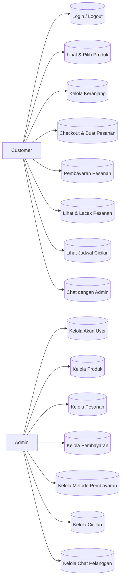
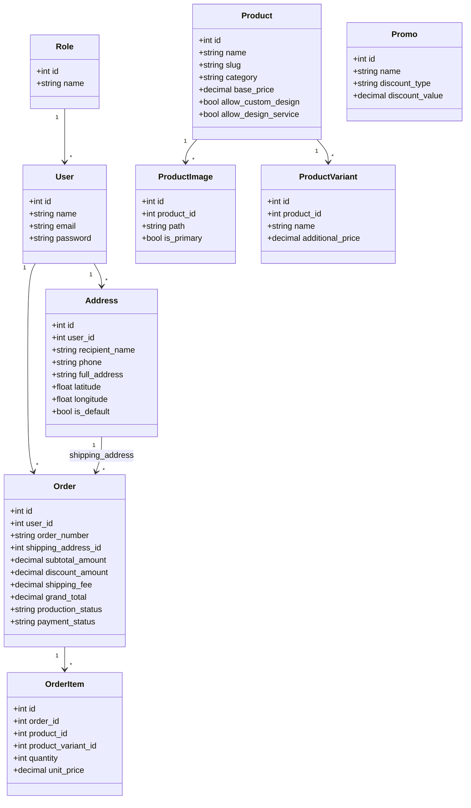
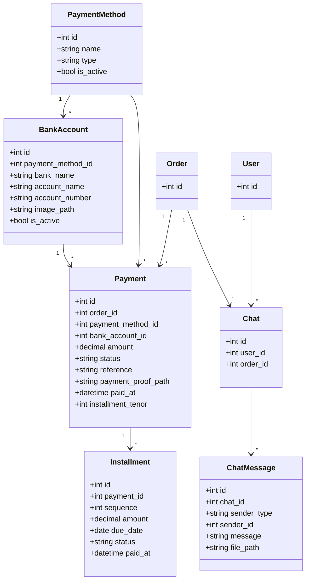
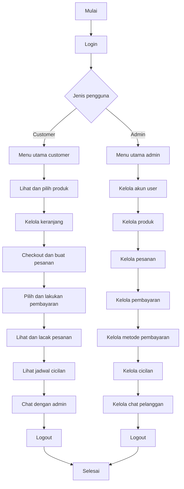
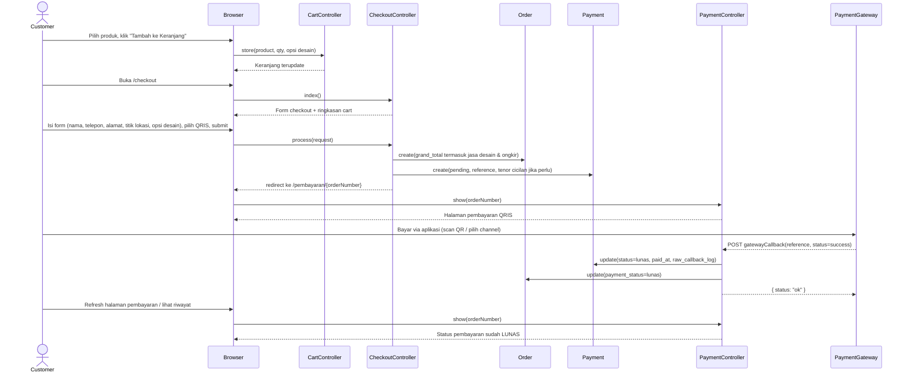

# Diagram Sistem Percetakan

## Use Case Diagram

## Class Diagram (Ringkas)

Untuk memudahkan penempatan pada gambar dengan rasio 1:1, diagram kelas berikut dipecah menjadi dua bagian: inti pemesanan dan pembayaran/chat. Masing-masing menggunakan layout vertikal (top-bottom) agar tidak terlalu melebar.

### Class Diagram – Inti Pemesanan

### Class Diagram – Pembayaran & Chat

## Activity Diagram (Alur Aktivitas Sistem)

## Sequence Diagram (Checkout & Pembayaran QRIS)

## Desain Output

**Halaman utama (frontend)**
- Beranda: daftar produk unggulan, produk terlaris, dan promo aktif.
- Katalog produk: grid produk dengan nama, harga dasar, kategori, status aktif.
- Detail produk: foto-foto, deskripsi, harga, estimasi waktu pengerjaan, opsi desain.
- Keranjang: tabel item (nama produk, qty, harga, jasa desain, subtotal, total).

**Proses pemesanan & pembayaran**
- Checkout: ringkasan order (alamat, jarak ke toko, ongkir, subtotal, jasa desain, grand total), pilihan metode pembayaran.
- Halaman pembayaran: data order, metode pembayaran, total tagihan.
  - QRIS/E-Wallet: informasi channel/QR dan status pembayaran.
  - Transfer bank/cicilan: informasi rekening, status pembayaran, link upload bukti.
  - Cicilan: ringkasan tenor, bunga total, cicilan per bulan, tabel jadwal cicilan.
- Riwayat & detail pesanan: daftar pesanan dengan status produksi/pembayaran, dan detail item.
- Halaman chat customer: daftar pesan dengan admin, termasuk lampiran bukti.

**Halaman admin (back office)**
- Dashboard: ringkasan pesanan, pembayaran, dan statistik singkat.
- Manajemen produk: daftar produk dengan aksi tambah, ubah, nonaktifkan, dan kelola gambar.
- Manajemen pesanan: daftar & detail pesanan, status produksi/pengiriman.
- Manajemen pembayaran: daftar payment, status, bukti transfer, referensi, jadwal cicilan.
- Manajemen metode pembayaran & rekening bank: daftar channel, nomor rekening, gambar/QR.
- Manajemen user: daftar user, detail, dan aksi reset password.
- Manajemen chat: daftar percakapan pelanggan dan balasan admin.

## Desain Input

**Form customer**
- Registrasi: nama, email, password, konfirmasi password.
- Login: email, password.
- Keranjang: product_id, quantity, opsi desain (custom/service), catatan (opsional).
- Checkout:
  - Data penerima: nama penerima, nomor telepon.
  - Alamat: teks alamat lengkap, koordinat latitude/longitude (dari peta), penandaan default.
  - Pembayaran: payment_method_id, tenor cicilan (jika metode cicilan).
- Upload bukti pembayaran: file bukti (jpg/png/pdf), catatan (opsional).
- Chat customer: isi pesan, file lampiran (opsional).

**Form admin**
- Produk: nama, slug, kategori, deskripsi, harga dasar, waktu pengerjaan, flag custom design/service, status aktif, gambar produk.
- Metode pembayaran & rekening bank: nama channel, tipe (qris/ewallet/bank_transfer/cash/installment), nama bank, nama pemilik, nomor rekening, gambar/logo/QR, status aktif.
- Pesanan: perubahan status produksi/pengiriman, catatan internal (opsional).
- Pembayaran: aksi verifikasi (set lunas/gagal), aksi simulasi callback, penandaan cicilan per bulan sebagai lunas.
- User: nama, email, role, reset password.

## Desain Database (Ringkasan ERD)

**Tabel utama**
- `tb_users`: menyimpan data pengguna (customer & admin) dengan relasi ke role.
- `tb_roles`: menyimpan peran (admin, customer) dan relasi ke users.
- `tb_products`: menyimpan produk percetakan (nama, slug, kategori, harga dasar, opsi desain, dst.).
- `tb_product_images`: menyimpan gambar produk dan penanda gambar utama.
- `tb_product_variants`: menyimpan variasi produk (jika digunakan) dan harga tambahan.
- `tb_promos`: menyimpan promo dan skema diskon.
- `tb_addresses`: menyimpan alamat pelanggan beserta koordinat lokasi dan penanda default.
- `tb_orders`: menyimpan pesanan (user, alamat, subtotal, diskon, ongkir, total, jarak, status produksi, status pembayaran, metode pengiriman).
- `tb_order_items`: menyimpan item per pesanan (produk, qty, harga, jasa desain, catatan).
- `tb_payment_methods`: menyimpan metode pembayaran (nama, tipe, status aktif).
- `tb_bank_accounts`: menyimpan data rekening bank/channel pembayaran terkait metode pembayaran.
- `tb_payments`: menyimpan transaksi pembayaran per order (metode, jumlah, status, reference, bukti, callback, data cicilan).
- `tb_installments`: menyimpan jadwal cicilan per payment (urutan, jumlah, jatuh tempo, status, tanggal bayar).
- `tb_chats`: menyimpan percakapan antara customer dan admin yang terkait order.
- `tb_chat_messages`: menyimpan pesan di dalam chat, termasuk jenis pengirim dan file lampiran.

## Blackbox Testing (Contoh Kasus Uji)

| Kode | Nama Pengujian                              | Input Utama                                                           | Expected Output                                                                                  |
|------|---------------------------------------------|------------------------------------------------------------------------|---------------------------------------------------------------------------------------------------|
| TC-01| Registrasi akun berhasil                    | Form registrasi diisi valid (nama, email unik, password cocok)       | Akun baru tersimpan di `tb_users`, user diarahkan ke login/berhasil login.                       |
| TC-02| Login gagal (password salah)                | Email terdaftar + password salah                                     | Autentikasi ditolak, muncul pesan error login gagal, tidak masuk ke dashboard.                   |
| TC-03| Tambah produk ke keranjang                  | Dari detail produk, pilih qty=2, opsi desain=service                 | Session `cart` berisi item dengan qty=2, total harga termasuk jasa desain 10% per item.          |
| TC-04| Checkout dalam radius 1 KM                  | Checkout dengan titik lokasi dalam radius ≤ 1 KM                     | `shipping_distance_km` terisi, `delivery_method = antar`, `shipping_fee = 0`, order tersimpan.   |
| TC-05| Checkout di luar radius 1 KM                | Checkout dengan titik lokasi > 1 KM                                  | `shipping_distance_km` terisi, `delivery_method = ambil_di_toko`, `shipping_fee = 0`.            |
| TC-06| Checkout dengan metode cicilan              | Pilih metode cicilan, tenor=3 bulan                                  | Order.grand_total termasuk bunga 3% x tenor, Payment dan 3 record `tb_installments` terbentuk.   |
| TC-07| Upload bukti pembayaran transfer bank       | Pesanan dengan metode bank transfer, upload file jpg valid           | `payment_proof_path` terisi, ChatMessage baru tercipta dengan lampiran bukti.                    |
| TC-08| Callback pembayaran QRIS sukses             | HTTP POST ke endpoint callback dengan reference valid, status=success| Payment.status menjadi `lunas`, `paid_at` terisi, Order.payment_status menjadi `lunas`.          |
| TC-09| Penandaan angsuran cicilan per bulan        | Di admin, tandai satu installment sebagai paid                       | Record installment berubah `status=paid`, Payment masih `pending` jika masih ada angsuran lain.  |
| TC-10| Semua angsuran cicilan lunas                | Semua installment untuk satu payment ditandai paid                    | Semua installment berstatus `paid`, Payment.status dan Order.payment_status menjadi `lunas`.     |
| TC-11| Penandaan cicilan overdue via command       | Ada installment `due_date` < hari ini dan status `pending`           | Setelah `php artisan installments:mark-overdue`, installment terkait berstatus `overdue`.        |

Relasi kunci:
- Satu `user` memiliki banyak `addresses`, `orders`, dan `chats`.
- Satu `order` memiliki banyak `order_items`, banyak `payments`, dan banyak `chats`.
- Satu `payment_method` memiliki banyak `payments` dan banyak `bank_accounts`.
- Satu `payment` memiliki banyak `installments`.
- Satu `chat` memiliki banyak `chat_messages`.

## Product Backlog (Ringkasan)

Tabel berikut merupakan ringkasan product backlog utama yang disusun berdasarkan analisis kebutuhan dan diimplementasikan pada project_baru.

| ID  | User Story                                                                                  | Prioritas | Sprint | Status       |
|-----|---------------------------------------------------------------------------------------------|-----------|--------|--------------|
| PB-01 | Sebagai user, saya dapat registrasi dan login/logout agar bisa mengakses fitur sesuai peran. | High      | 1      | Selesai      |
| PB-02 | Sebagai admin, saya dapat mengelola data akun user (tambah, ubah, nonaktifkan, reset sandi). | High      | 1      | Selesai      |
| PB-03 | Sebagai admin, saya dapat mengelola data produk percetakan beserta gambar dan variannya.    | High      | 1      | Selesai      |
| PB-04 | Sebagai customer, saya dapat menambahkan produk ke keranjang dan mengubah jumlah pesanan.   | High      | 1      | Selesai      |
| PB-05 | Sebagai customer, saya dapat melakukan checkout, memilih alamat, dan membuat pesanan.       | High      | 2      | Selesai      |
| PB-06 | Sebagai customer, saya dapat memilih metode pembayaran (tunai, transfer, QRIS, e-wallet, cicilan). | High | 2 | Selesai |
| PB-07 | Sebagai sistem, saya menghitung ongkir berdasarkan jarak dan bunga cicilan per tenor.        | Medium    | 2      | Selesai      |
| PB-08 | Sebagai admin, saya dapat mengelola metode pembayaran dan rekening bank yang digunakan.     | Medium    | 2      | Selesai      |
| PB-09 | Sebagai customer, saya dapat mengunggah bukti pembayaran dan admin dapat memverifikasinya.  | High      | 3      | Selesai      |
| PB-10 | Sebagai customer, saya dapat melihat riwayat dan status pesanan saya secara real-time.      | High      | 3      | Selesai      |
| PB-11 | Sebagai customer dan admin, saya dapat berkomunikasi lewat chat termasuk mengirim gambar revisi desain. | Medium | 3 | Selesai |
| PB-12 | Sebagai admin, saya dapat melihat dashboard berisi ringkasan pesanan, pendapatan, dan grafik penjualan. | Medium | 3 | Selesai |
