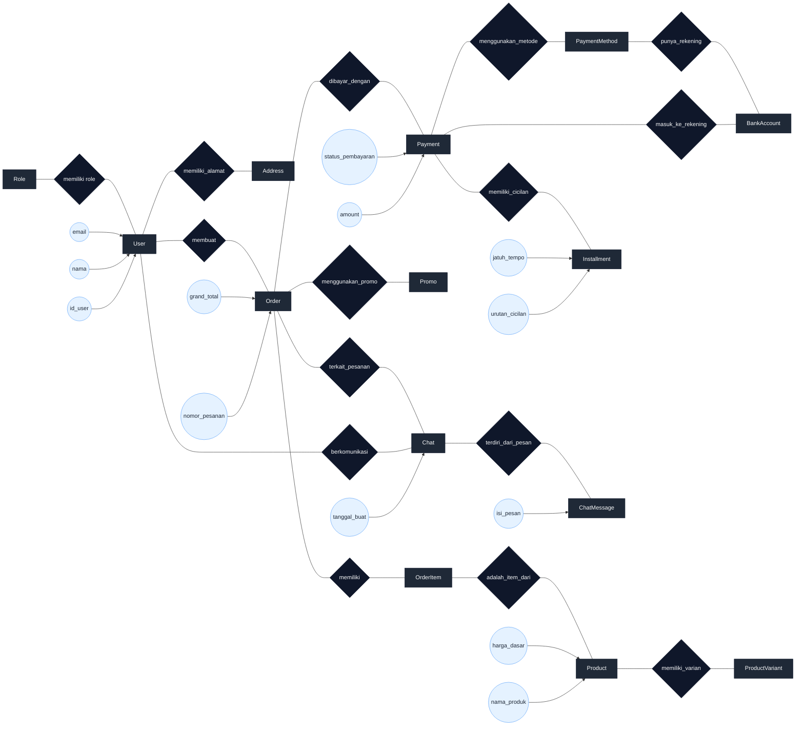

## ERD Konseptual (Gaya Diagram Oval)

Bagian ini menyajikan ERD konseptual dengan gaya mirip contoh buku (entitas persegi panjang, atribut oval, dan relasi bertuliskan kata kerja) untuk memudahkan dimasukkan ke bab analisis/perancangan.

diagram ERD tersebut menggambarkan bahwa data di sistem dibagi ke dalam entitas‑entitas terpisah (seperti User, Role, Product, Order, Payment, Chat, dan lain‑lain) yang masing‑masing menyimpan satu jenis informasi saja. Setiap hubungan antar entitas tidak digambarkan dengan garis langsung, tetapi selalu melalui relasi (diamond) yang diberi nama kata kerja, misalnya “memiliki role”, “membuat pesanan”, “menggunakan metode pembayaran”, atau “berkomunikasi”. Dengan cara ini, struktur data menjadi lebih rapi, tidak terjadi entitas saling “bertemu” langsung, dan lebih mudah dipetakan ke basis data relasional yang sudah ternormalisasi.
